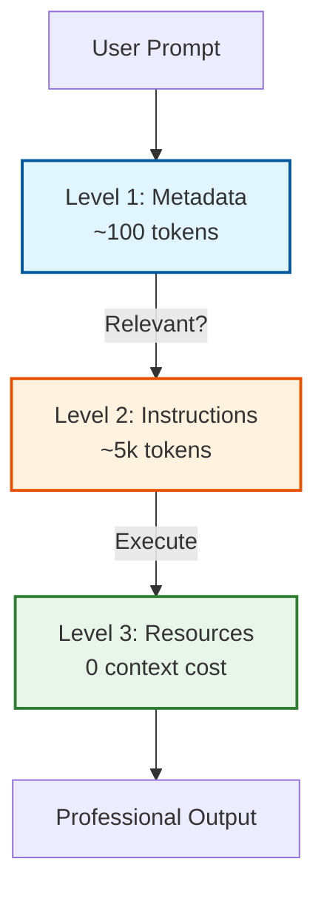
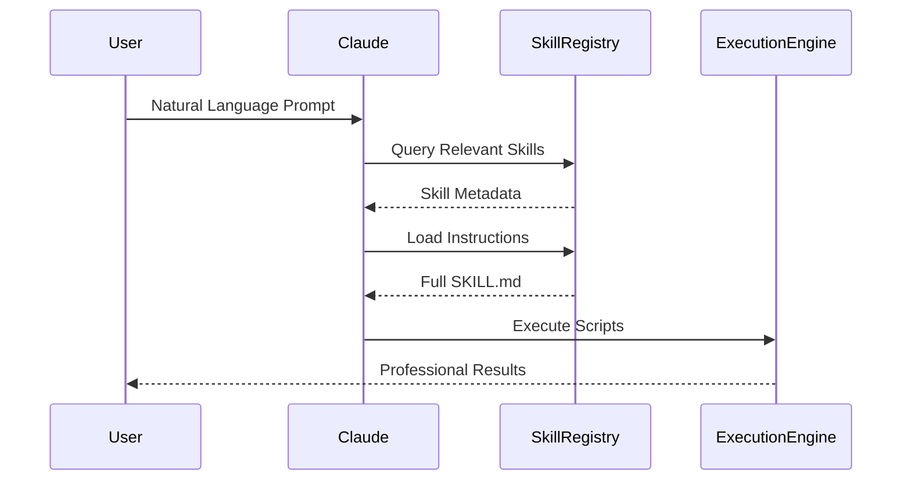

# PowerSuite Pro for Claude

[](https://opensource.org/licenses/MIT)
[](https://www.python.org/downloads/)
[](http://makeapullrequest.com)
[](https://github.com/vedantparmar12/PowerSuite-Pro)

> Transform single prompts into professional business solutions with 6 powerful Claude Agent Skills

---

## 🎯 Overview

PowerSuite Pro delivers **6 enterprise-grade skills** that transform Claude into a complete business automation platform:

| Skill | Purpose | Key Features |
|-------|---------|--------------|
| **PowerPoint Creator** | Professional presentations | Intelligent content generation, brand integration, audience adaptation |
| **Excel Master** | Advanced spreadsheets | Formula generation, charts, automation, dashboards |
| **PDF Processor** | Document operations | Creation, editing, extraction, form filling, security |
| **Financial Analytics** | Enterprise modeling | Valuation (DCF), risk analysis, forecasting, portfolio optimization |
| **Web Intelligence** | Market research | Competitive analysis, trend monitoring, SEO optimization |
| **Communication Master** | Email automation | Professional composition, workflows, multi-language support |

---

## ✨ Why Skills Beat MCP

Based on Claude's Agent Skills architecture, these skills offer distinct advantages:

### Performance Benefits
- **Progressive Disclosure**: Only loads relevant content when needed (3-level architecture)
- **Context Efficiency**: Metadata consumes ~100 tokens; full content loads on-demand
- **Zero Pollution**: Unused skill content doesn't consume context window

### Architectural Advantages  
- **Filesystem-Based**: Organized directory structure
- **Executable Scripts**: Code runs via bash without loading into context (unlimited capacity)
- **Intelligent Activation**: Claude determines relevance automatically

### User Experience
- **Universal Compatibility**: Works with Claude API, Claude Code, and claude.ai
- **Automatic Triggering**: Skills activate based on user intent
- **Zero Setup**: Seamless operation after installation

---

## 🏗 Architecture

### Progressive Disclosure System



### Skills Interaction Flow



### Performance Metrics

| Component | Skills | MCP |
|-----------|--------|-----|
| Initial Overhead | ~600 tokens | High (all tools) |
| Loading Strategy | Progressive | Eager |
| Code Storage | Filesystem (∞) | Context (limited) |
| Execution Speed | Fast (bash) | Slower |
| Platform Support | Universal | Limited |

---

## 📦 Installation

### Prerequisites

```bash
# Python 3.8 or higher
python --version

# Install dependencies
pip install python-pptx>=0.6.21 openpyxl>=3.1.0 pandas>=1.5.0 pillow>=9.0.0 xlsxwriter>=3.0.0
```

### Quick Setup

```bash
# Clone repository
git clone https://github.com/vedantparmar12/PowerSuite-Pro.git
cd PowerSuite-Pro

# Verify installation
python test_skills.py
```

Expected output:
```
✓ All skills loaded successfully
✓ Dependencies verified
✓ Scripts executable
✓ Templates accessible
```

---

## 🚀 Quick Start

### Claude API Integration

```python
import anthropic

client = anthropic.Anthropic(api_key="your-api-key")

response = client.beta.messages.create(
    model="claude-sonnet-4-5-20250929",
    max_tokens=4096,
    betas=["code-execution-2025-08-25", "skills-2025-10-02"],
    container={
        "skills": [
            {"type": "custom", "skill_path": "/path/to/professional-ppt-skill"},
            {"type": "custom", "skill_path": "/path/to/excel-master-skill"},
            {"type": "custom", "skill_path": "/path/to/pdf-master-skill"},
            {"type": "custom", "skill_path": "/path/to/financial-analytics-skill"},
            {"type": "custom", "skill_path": "/path/to/web-intelligence-skill"},
            {"type": "custom", "skill_path": "/path/to/communication-master-skill"}
        ]
    },
    messages=[{"role": "user", "content": "Create a quarterly business review presentation"}],
    tools=[{"type": "code_execution_20250825", "name": "code_execution"}]
)
```

### Claude.ai Integration

1. **Settings** → **Capabilities** → **Skills**
2. Click **"Add Custom Skill"**
3. Upload skill directories
4. Enable skills in workspace
5. Start with natural language prompts

---

## 💡 Usage Examples

### Single Skill Usage

```
"Create a 10-slide presentation about renewable energy for investors"
→ PowerPoint Creator generates comprehensive deck with analysis

"Build a project budget tracker with monthly expense categories"
→ Excel Master creates structured workbook with formulas and charts

"Extract invoice data from PDFs and create a summary report"
→ PDF Processor analyzes documents and compiles findings
```

### Multi-Skill Workflows

**Data Analysis + Presentation**
```
"Analyze Q4 sales data from Excel and create executive presentation"
→ Excel Master analyzes data → PowerPoint Creator builds presentation
```

**Research + Documentation**
```
"Research competitor pricing strategies and create comparison report"
→ Web Intelligence gathers data → PDF Master creates formatted report
```

**Financial Analysis + Communication**
```
"Perform DCF valuation and draft investor email with summary"
→ Financial Analytics runs valuation → Communication Master drafts email
```

---

## 🎯 Best Practices

### Effective Prompts

**✓ Good:**
```
"Create quarterly sales presentation with trend analysis and forecasts"
"Build project budget tracker with automated variance calculations"
"Generate DCF valuation model with sensitivity analysis"
```

**✗ Avoid:**
```
"Make a presentation"  (too vague)
"Do Excel stuff"       (unclear)
"Help with finance"    (no specific task)
```

### Optimization Tips

1. **Be Specific**: Include audience, purpose, and requirements
2. **Combine Tasks**: Multiple operations in one prompt
3. **Leverage Automation**: Let skills handle formatting
4. **Provide Context**: Share relevant background
5. **Iterate**: Use follow-up prompts to refine results

---

## 🐛 Troubleshooting

### Common Issues

**Skills not triggering:**
- Verify skills enabled in settings
- Use explicit keywords (e.g., "presentation", "spreadsheet")
- Check skill paths are correct

**Script execution errors:**
- Verify Python dependencies installed
- Check file permissions
- Review error logs in output

**Low-quality output:**
- Provide more context in prompt
- Specify audience and purpose
- Include sample data or examples

### Debug Mode

```python
response = client.beta.messages.create(
    model="claude-sonnet-4-5-20250929",
    # ... other parameters ...
    debug=True  # Enable verbose logging
)
```

---

## 🤝 Contributing

### Development Setup

```bash
# Fork and clone
git clone https://github.com/vedantparmar12/PowerSuite-Pro.git
cd PowerSuite-Pro

# Install dependencies
pip install -r requirements.txt

# Run tests
python test_skills.py
```

### Contribution Workflow

1. Create feature branch: `git checkout -b feature/amazing-feature`
2. Make changes following existing code style
3. Commit and push: `git commit -m "Add amazing feature"`
4. Create pull request with clear description

### Adding Features

- **Extend Skills**: Edit `SKILL.md` files and Python scripts
- **New Templates**: Add to skill directories; auto-discovered
- **New Functions**: Update `*_creator.py` or `*_master.py` files

---

## 📞 Support

### Getting Help

- **📖 Documentation**: [SKILL.md files](./professional-ppt-skill/SKILL.md)
- **💬 Discussions**: [GitHub Discussions](https://github.com/vedantparmar12/PowerSuite-Pro/discussions)
- **🐛 Issues**: [GitHub Issues](https://github.com/vedantparmar12/PowerSuite-Pro/issues)
- **📧 Email**: [vedantparmarsingh@gmail.com](mailto:vedantparmarsingh@gmail.com)

### Reporting Bugs

Include: Python version, OS, full error message, reproduction steps, expected vs actual behavior

---

## 📁 Project Structure

```
PowerSuite-Pro/
├── professional-ppt-skill/
│   ├── SKILL.md
│   ├── scripts/ppt_creator.py
│   └── [templates/, assets/]
├── excel-master-skill/
│   ├── SKILL.md
│   ├── scripts/excel_master.py
│   └── [templates/, samples/]
├── pdf-master-skill/
│   ├── SKILL.md
│   ├── scripts/pdf_master.py
│   └── [templates/, examples/]
├── financial-analytics-skill/
│   ├── SKILL.md
│   ├── scripts/financial_engine.py
│   └── [models/, datasets/]
├── web-intelligence-skill/
│   ├── SKILL.md
│   ├── scripts/web_intelligence.py
│   └── [templates/, datasets/]
├── communication-master-skill/
│   ├── SKILL.md
│   ├── scripts/communication_master.py
│   └── [templates/, workflows/]
├── test_skills.py
├── requirements.txt
└── README.md
```

---

## 🌟 Why PowerSuite Pro?

### Technical Excellence
- **Zero Context Overhead**: Scripts don't consume context when unused
- **Infinite Scalability**: Unlimited code without context penalty  
- **Intelligent Loading**: Only relevant content enters context

### Business Impact
- **Time Savings**: Minutes instead of hours
- **Professional Quality**: Enterprise-grade output
- **Consistency**: Standardized formatting across all outputs

---

## 📄 License

MIT License - see [LICENSE](LICENSE) file for details

---

## 🙏 Acknowledgments

Built on [Claude Agent Skills](https://docs.claude.com) architecture | Powered by [Anthropic Claude](https://www.anthropic.com)

---

**Ready to transform your workflow? Star us and get started today!** ⭐
